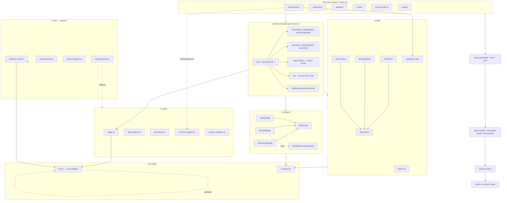

# Architecture

Quick map of how the project hangs together. Nothing fancy — Page Object Model
on the UI side, thin typed clients on the API side, a custom Playwright `test`
that wires them together with logging.

## Diagram

## Layers

### Tests (`tests/`)

Split by purpose, **not** by feature. So `smoke/`, `regression/ui`, `regression/api`,
`negative/`, `visual/`, `performance/`, `api/contracts/`. The split lines up
with Playwright project routing: `**/api/**` paths run only in the `api` project,
the rest run in the browser projects (chromium/firefox/webkit and the mobile
emulations).

### Fixtures (`src/fixtures/playwright-fixtures.ts`)

The one place where everything is wired up. Spec files import `test` and
`expect` from here, never from `@playwright/test` directly. That gives me a
single seam to:

- inject Page Object instances (`homePage`, `bookingPage`, …)
- inject API clients (`authClient`, `bookingClient`, …)
- expose a worker-scoped `adminToken` so we don't hammer `/auth/login`
- attach a per-test pino logger via `log`
- register custom matchers (`toMatchSchema`) as a side-effect import

### Page Objects (`src/pages/`)

Classic POM with a deliberately tiny `BasePage`. Anything that fits one page
lives on that page, period. Selectors prefer role + text where the demo allows,
and fall back to CSS with `.or()` chains where the DOM is too generic.

`BookingFormComponent` was extracted in week 2 once the same set of guest fields
showed up in two places. Components live under `src/pages/components/` and don't
extend `BasePage`.

### API layer (`src/api/`)

`BaseClient` adds one thing: `expectOk()`, which throws a useful error on
non-2xx instead of letting tests crash on `JSON.parse('<html>')`. Concrete
clients are thin and typed. Schemas under `schemas/` mirror the response types
under `types/` and are used by both contract tests and the `toMatchSchema`
matcher.

### Utilities (`src/utils/`)

Single-purpose helpers, no kitchen sinks. The notable ones:

- `logger.ts` — pino with pretty-print locally, JSON in CI.
- `schema-validator.ts` — AJV wrapper. `strict: false` so `$schema` meta keyword
  doesn't trigger warnings.
- `custom-matchers.ts` — registers `expect(...).toMatchSchema(jsonSchema)` and
  augments the `@playwright/test` matcher interface so TS is happy.
- `perf-recorder.ts` — appends JSONL samples to `performance-results/` for
  whenever I get around to building a trend dashboard.

### Config (`src/config/`)

`env.ts` loads `.env.<TEST_ENV>` then `.env`, then validates with zod.
Anything else just dies with a useful message on import — much better than
finding `undefined.toLowerCase()` halfway through a test.

### AI (`src/ai/` — optional)

Three independent helpers behind a shared `isAiEnabled()` gate. Without
`ANTHROPIC_API_KEY` set, the data generator silently falls back to faker
(tests don't change), the test generator and failure analyzer print a clean
"AI disabled" message and exit. See [ai-features.md](./ai-features.md) for
the full story.

## Cross-cutting decisions

### Why POM and not just helpers?

I tried both in earlier projects. Helpers degenerate into a 2000-line
`utils.ts` after about a month. POM forces a per-page boundary which keeps
PR diffs small.

### Why structure tests by purpose, not by feature?

CI matrix readability. `regression/api` runs only in the `api` project,
`visual/` only on Linux chromium in nightly, `smoke/` is fast and runs first
on every PR. Splitting by purpose makes those rules natural — splitting by
feature would need test-level tags or annotations to do the same thing.

### Why no global setup that logs in once?

I have a worker-scoped `adminToken` fixture that already does this for API
tests (login once per worker, reused across the worker's tests).
For UI admin tests, a `storageState` cache would shave another second or two —
on the [Future Improvements](../README.md#future-improvements) list, just
hasn't bitten yet.
